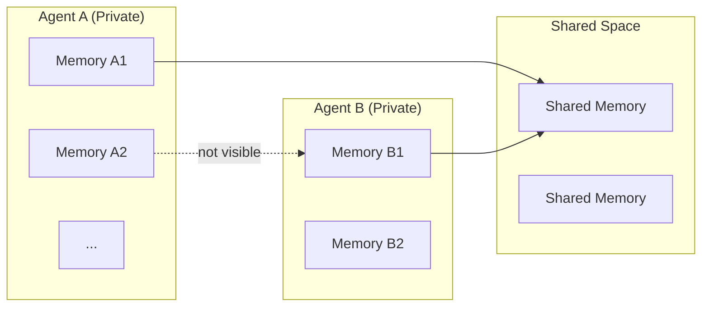

<div align="center">

# 🧠 Agent Memory Store

**Give your AI agents long-term memory that actually works.**

[](https://pypi.org/project/agent-memory-store/)
[](https://pypi.org/project/agent-memory-store/)
[](LICENSE)
[](tests/)

</div>

---

## 🏗️ Architecture



Each agent has **completely isolated** private memory. Shared space is opt-in.

---

Built this because I was tired of agents forgetting everything between conversations. No magic, no vector embeddings — just a simple key-value store with proper isolation between agents.

When you run multiple AI agents, they inevitably step on each other's toes. Agent A reads Agent B's memories, shared context gets mixed up, and suddenly your customer support bot is talking about internal devops stuff.

This library solves that. 🎯

## ✨ Features

| | |
|---|---|
| 🔒 **Agent Isolation** | Each agent gets its own private memory space |
| 🤝 **Shared Spaces** | Optional shared areas for inter-agent communication |
| 💬 **Session Tracking** | Group memories by conversation |
| ⏳ **TTL Support** | Auto-expire old memories |
| ⚡ **Zero Config** | In-memory by default, no external services needed |
| 💾 **Pluggable Backends** | In-memory, SQLite, JSON file |

## 📦 Install

```bash
pip install agent-memory-store
```

> Requires Python 3.9+

## 🚀 Quick Example

```python
from agent_memory_store import AgentMemoryStore

store = AgentMemoryStore()

# Give an agent its own memory
memory = store.get_agent_memory("support-bot")

# Remember stuff
memory.add("Customer asked about enterprise pricing")
memory.add("FAQ: cancellation takes 24h to process")

# Search later
results = memory.search("pricing")
```

That's it. No setup, no config, no external services.

---

## 🔒 Multi-Agent Isolation

Each agent's memory is completely private by default:

```python
store = AgentMemoryStore()

sales = store.get_agent_memory("sales-bot")
support = store.get_agent_memory("support-bot")

sales.add("Q3 target: $500k")
support.add("Refund policy updated")

# They can't see each other's memories
sales.search("refund")   # → []
support.search("sales")  # → []
```

## 🤝 Shared Memory

When agents need to share knowledge:

```python
store = AgentMemoryStore()

# Create a shared space
shared = store.get_shared_memory("product-knowledge")
shared.add("🚀 Product launch: May 15th")

# Grant access to multiple agents
sales = store.get_agent_memory("sales-bot", shared_spaces=["product-knowledge"])
support = store.get_agent_memory("support-bot", shared_spaces=["product-knowledge"])

# Both see the shared memory
sales.search("launch")   # ✅ finds it
support.search("launch") # ✅ finds it
```

## 💬 Session Tracking

Group memories by conversation:

```python
memory = store.get_agent_memory("support-bot")

with memory.session("conv-12345") as s:
    s.add("Customer: I can't login")
    s.add("Solution: Password reset email sent")

# Pull all memories from a specific conversation
memory.get_by_session("conv-12345")
```

## ⏳ Auto-Expiring Memories

```python
from datetime import timedelta

memory.add("Temp context for current task", ttl=timedelta(hours=1))
# Poof. Gone after 1 hour.
```

---

## 💾 Backends

| Backend | Use Case | Config |
|---|---|---|
| `memory` _(default)_ | Development, testing | `AgentMemoryStore()` |
| `sqlite` | Persistent, single-process | `AgentMemoryStore(backend="sqlite", path="./memories.db")` |
| `json` | Persistent, human-readable | `AgentMemoryStore(backend="json", path="./memories.json")` |

---

## 📖 API

### `AgentMemoryStore`

```python
store = AgentMemoryStore()

memory = store.get_agent_memory(agent_id, shared_spaces=[...])
shared = store.get_shared_memory(space_id)

store.list_agents()        # → ["sales-bot", "support-bot"]
store.list_shared_spaces() # → ["product-knowledge"]
```

### `AgentMemory`

```python
memory.add(content, metadata=None, ttl=None, session_id=None)
memory.search(query, limit=10)   # → list[MemorySearchResult]
memory.get_all()                  # → list[Memory]
memory.get_by_session(session_id) # → list[Memory]
memory.delete(memory_id)          # → bool
memory.clear()                    # clear all for this agent
```

### `SharedMemory`

```python
shared.add(content, metadata=None, ttl=None)
shared.search(query, limit=10)
shared.get_all()
shared.clear()
```

---

## ⚠️ What This Is Not

- ❌ Not a vector database — no embeddings, no semantic search
- ❌ Not for huge data — it's an in-memory store with optional persistence
- ❌ Not distributed — single process only (for now)

## ✅ What This Is

- ✅ Fast — just Python dicts under the hood
- ✅ Simple — 5 minute learning curve
- ✅ Isolated — agents can't accidentally read each other's stuff
- ✅ Zero dependencies — only Python stdlib

---

## 📄 License

[MIT](LICENSE) — do whatever you want with it.